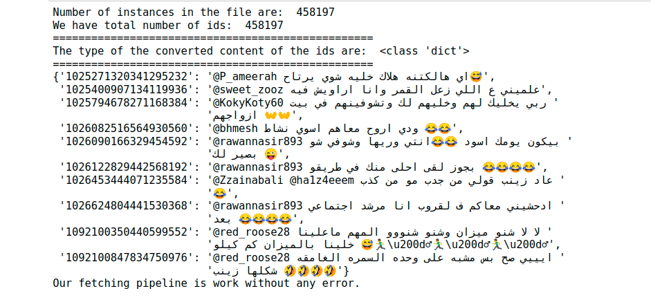

# AIM_ML_Task


Many countries speak Arabic; however, each country has its own dialect, the aim of this repo is to build a model that predicts the dialect given the text.

In this work we have passed through different phases from fetching the data, to process it, shuffle the data for the next stage of preparation and run the model on. And how we come over these stages is decribed below.

## Data Fetching

We have the original dataset without the text column, which what we will use for feature engineering to predict which text belong to which dialect. So for that we have design our pipeline for fetching the data using the ids of the original dataset, once we get all of text related to all ids we save new csv file with the new text column.

### How we passed through this stage

- First read the original dataset file.
- Then, convert the data types of values in id column of the original dataset into string instead of integer.
- Then, get that column as list of strings each of these string art is related to tweet.
- Then, loop over batches of maximum 1000 of ids and call the APIs to get corresponding tweets of these ids.
- Then, handle requirements for saving new csv file with the new text column.


**To see this stage of fetching data, check the [fetch_data.py script](https://github.com/Abdelrahmanrezk/AIM_ML_Task/blob/main/fetch_data.py) script, its fully documented, and to get overview of the result from this stage check [Data Fetching.ipynb notebook](https://github.com/Abdelrahmanrezk/AIM_ML_Task/blob/main/Data%20Fetching.ipynb).**

**Quick intuition about what we got from this stage**



## How To Use

First you need to install the requirements using snip code below, in case of missed libraries error try to pip3 install "name of library" like in snap code below.

```python

pip3 install -r requirements.txt

# in case of missed libraries error
pip3 install nltk

```


